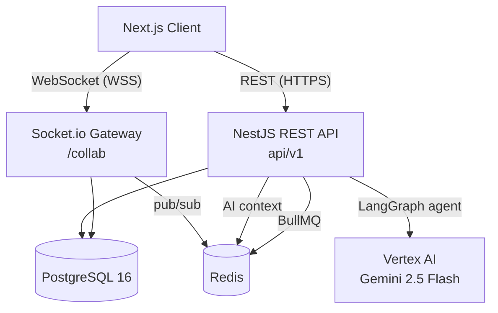

# OnSheet Backend — Documentation

> NestJS REST + WebSocket API powering OnSheet, a real-time collaborative spreadsheet application.

---

## Contents

| Document | Description |
|---|---|
| [Architecture](./architecture.md) | High-level system overview, module graph, HTTP request pipeline, horizontal scaling |
| [Database](./database.md) | Prisma schema, ER diagram, model descriptions, key constraints |
| [Authentication](./auth.md) | JWT + httpOnly cookie strategy, token lifecycle, Passport guards |
| [Access Control](./access-control.md) | RBAC — OWNER / EDITOR / COMMENTER / VIEWER, permission check methods, public sharing |
| [API Reference](./api.md) | All HTTP endpoints with request/response examples |
| [WebSocket Events](./websockets.md) | Full Socket.io event reference for the `/collab` namespace |
| [Collaboration](./collaboration.md) | Real-time sync, write batching, OCC conflict resolution, late-joiner catchup |
| [AI Agent](./ai.md) | LangGraph ReAct agent, tools, conversation context (Redis), single-turn endpoints |
| [Background Jobs](./jobs.md) | BullMQ export/import queue processors |
| [Deployment](./deployment.md) | Environment variables, Docker, Prisma, production checklist |

---

## Quick System Overview

## Key Design Decisions

| Decision | Rationale |
|---|---|
| httpOnly cookies for JWT | XSS-proof token storage; `sameSite:none` needed for cross-origin Next.js ↔ NestJS |
| Refresh token bcrypt-hashed in DB | Prevents reuse after logout; single-use semantics |
| 50 ms write batching in gateway | Eliminates per-keystroke DB writes; last-writer-wins deduplication per cell |
| `baseVersion` OCC field | Detects mid-air collisions without pessimistic locks; returns `serverCell` for re-merge |
| Fire-and-forget operation log | Never blocks the write path; enables audit trail + late-joiner catchup |
| Redis adapter for Socket.io | Transparent horizontal WS scaling — room broadcasts work across all instances |
| In-memory presence only | Cursor positions are ephemeral; zero DB writes per cursor move |
| LangGraph ReAct agent | Multi-step reasoning over live sheet data before producing a final answer |
| Write tool `_action` discriminant | Frontend applies AI writes as optimistic updates — no full grid refetch needed |
| Raw SQL bulk upsert | `INSERT ... ON CONFLICT DO UPDATE` batched at 3 000 rows to stay under PG parameter limit |
