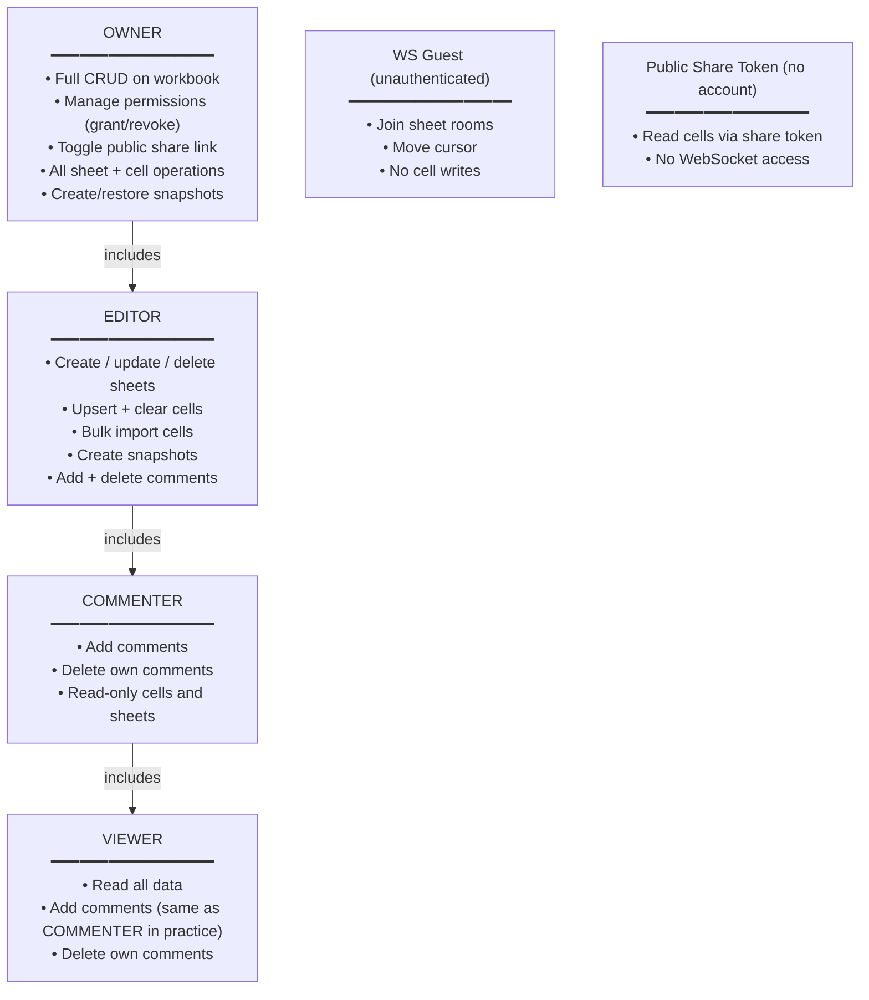
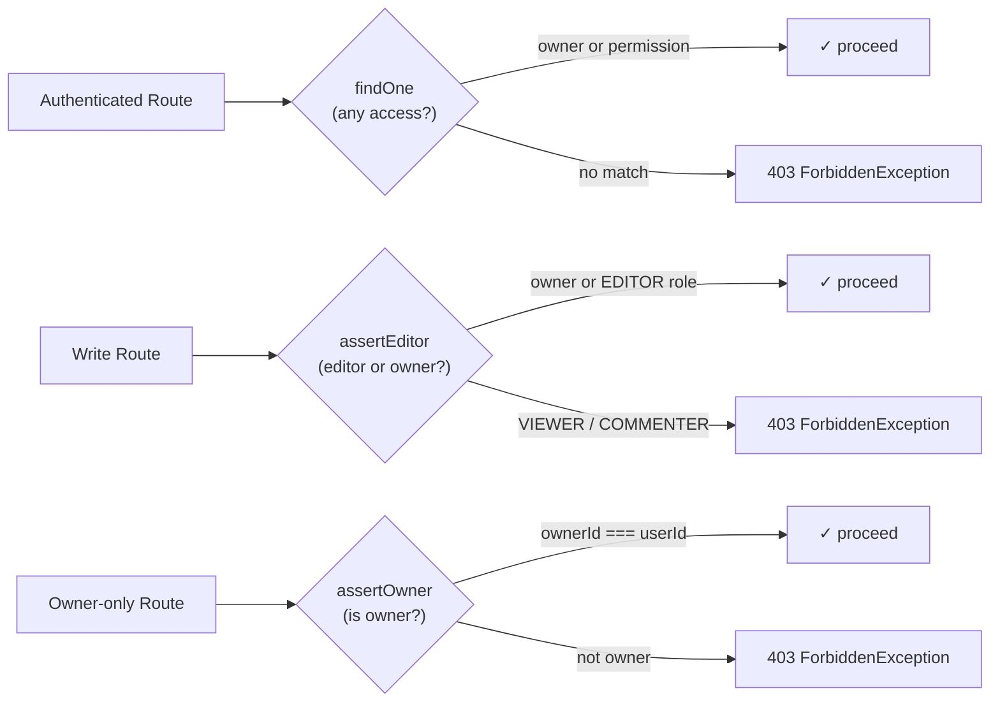

# Access Control

## Role Hierarchy

---

## Permission Checks

Each route delegates to one of three guard methods on `WorkbooksService`:

| Method | Condition | Used by |
|---|---|---|
| `findOne(id, userId)` | Owner OR any `Permission` row exists | All read routes, `addComment`, own-comment delete |
| `assertEditor(id, userId)` | Owner OR `role = EDITOR` | Sheet write, cell write, snapshot create/restore, others' comment delete |
| `assertOwner` (private) | Must be `ownerId` | Workbook rename/delete, share settings, permission management |

> **Note on comments:** `addComment` and own-comment `deleteComment` use `findOne` (not `assertEditor`). This means VIEWER and COMMENTER have identical effective permissions for commenting — both can add and delete their own comments. The role distinction is enforced only for deleting *others'* comments (requires EDITOR or owner).

---

## Sharing Mechanics

### Explicit sharing (Permission table)

Owner invites collaborator by email via `POST /workbooks/:id/permissions`. This creates or updates a `Permission` row with an assigned role. The workbook then appears under the invitee's `/workbooks/shared-with-me` list.

### Public share link

Owner calls `PATCH /workbooks/:id/public-access` to toggle `publicAccess = true`. This auto-generates a `shareToken` (UUID via `node:crypto` `randomUUID()`) on first enable. Anyone with the token can:

- `GET /workbooks/public/:shareToken` — read workbook metadata
- `GET /public/sheets/:shareToken/:sheetId/cells` — read cells (no auth required)

Disabling public access sets `publicAccess = false` but preserves the `shareToken` for re-enabling later.

---

## WebSocket Guests

On WebSocket connection, `CollabGateway` attempts:

1. JWT from `handshake.auth.token`
2. Cookie `accessToken`
3. Cookie `refreshToken`

If all fail → socket is tagged as a guest (`guestId = "guest_XXXX"`). Guests can:

- Join rooms (`sheet:join`)
- Move cursors (`cursor:move`)

Guests **cannot** emit `cell:update` — the gateway rejects this with `collab:error { message: "Guests cannot edit cells" }`.

---

## `myRole` Field

`GET /workbooks/:id` returns `myRole` on the workbook object:

- `"OWNER"` — if `workbook.ownerId === userId`
- `"EDITOR"` / `"VIEWER"` / `"COMMENTER"` — from `Permission.role` (lowercased in shared-with-me responses)
