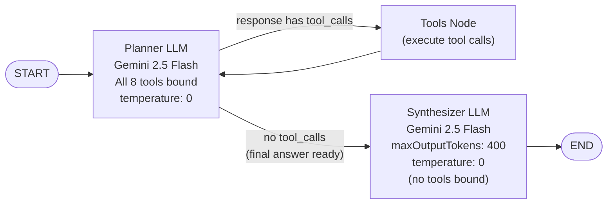
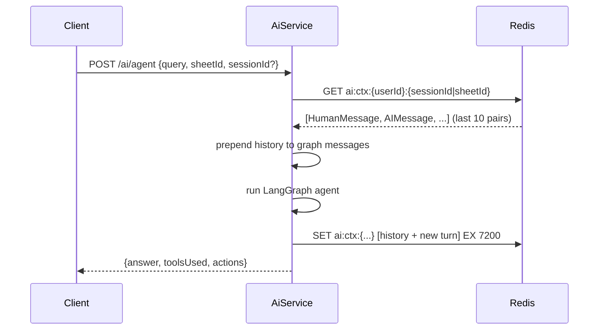
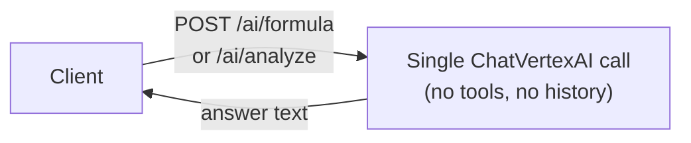

# AI Agent System

OnSheet's AI features are powered by **LangChain + LangGraph** running on **Google Vertex AI (Gemini 2.5 Flash)**.

---

## LangGraph ReAct Agent

The `/ai/agent` endpoint runs a full **ReAct (Reason + Act)** loop using a LangGraph `StateGraph`. The agent can read and write live sheet data through a set of typed tools.



`recursionLimit: 15` — at most 15 Planner ↔ Tools cycles per request.

**Two separate LLMs intentionally:**
- **Planner** — has all tools bound, does the reasoning + tool calling
- **Synthesizer** — no tools, pure text generation — ensures the final answer is concise and doesn't accidentally trigger more tool calls

---

## Tools

### Read Tools

| Tool | Description | Limit |
|---|---|---|
| `get_sheet_cells` | Fetch cells with optional row/col range filter | Max 500 cells |
| `get_sheet_statistics` | Total cells, formula count, data cells, empty cells, grid dimensions | — |
| `find_formula_errors` | Scan formula cells for `#VALUE!` `#REF!` `#NAME?` `#DIV/0!` `#NUM!` `#N/A` `#NULL!` | — |
| `get_cell_history` | CellOperation log for a specific cell, newest first | — |
| `find_data_anomalies` | Duplicate values per column + mixed-type columns | Scans ≤ 2 000 cells |

### Write Tools

| Tool | Description | Limit |
|---|---|---|
| `set_cells` | Upsert cells with values or formulas | Max 200 cells per call |
| `delete_cells` | Delete all cells in a rectangular range | — |
| `add_comment` | Create a `CellComment` at a given (row, col) | — |

### Write Tool Actions

Write tools embed an `_action` discriminant in their JSON result. After the graph completes, `runAgent` scans all `ToolMessage` results for `_action` fields and returns them as `AgentResult.actions[]`:

```ts
interface AgentResult {
  answer: string;
  toolsUsed: string[];
  actions: AgentAction[];   // frontend applies these as optimistic updates
}
```

This means the frontend can reflect AI writes **without a full grid refetch** — it applies the actions from the response directly to the client state.

---

## Conversation Context

The agent is stateful per user session. Context is stored in Redis with a 2-hour TTL.



- Key format: `ai:ctx:{userId}:{sessionId}` (or `ai:ctx:{userId}:{sheetId}` if no sessionId)
- Max **10 human+AI pairs** retained — oldest pair evicted when limit reached
- TTL **resets** on every turn (sliding window: 2 hours since last message)
- Redis failures are silently ignored (`try/catch`, best-effort)

---

## LLM Configuration

```ts
// Planner — does reasoning and calls tools
new ChatVertexAI({
  model: "gemini-2.5-flash",
  temperature: 0,
  authOptions: { /* API key or service account or ADC */ }
})

// Synthesizer — produces final answer text only
new ChatVertexAI({
  model: "gemini-2.5-flash",
  temperature: 0,
  maxOutputTokens: 400,
})
```

Auth priority: `GOOGLE_VERTEX_AI_API_KEY` env var → service account JSON (via `GOOGLE_APPLICATION_CREDENTIALS`) → Application Default Credentials (ADC).

---

## Tool Binding Cache

`AiService` maintains a `Map<userId, { llmWithTools, toolsNode }>`. Tools are bound to the LLM once per user per server lifetime — avoids re-binding the full tool schema on every request. Cache is in-memory (lost on restart).

---

## Single-Turn Endpoints

`/ai/formula` and `/ai/analyze` are **single LLM calls** — no LangGraph, no tools:



These are fast, cheap calls. Use `/ai/agent` when you need the model to read/modify live sheet data.

---

## Rate Limits

`20 req / 60 s` per user (ai throttle bucket) — applies to all three endpoints.
