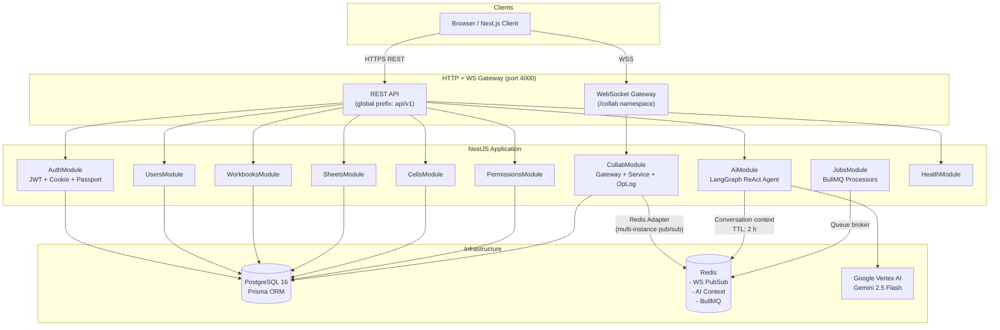
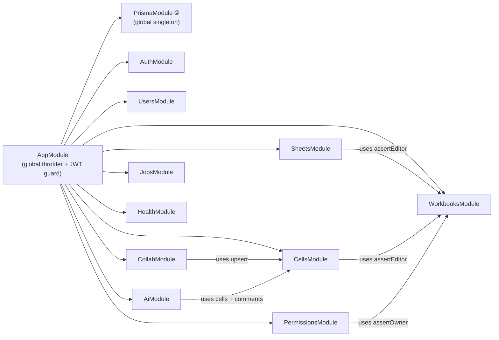
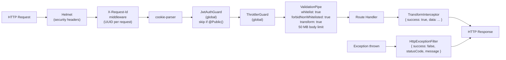
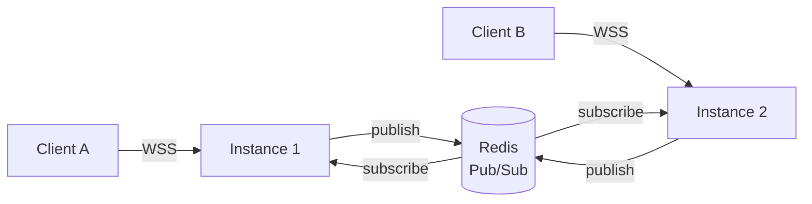

# System Architecture

## High-Level Overview



---

## Module Dependency Graph



> `PrismaModule` is `@Global()` — available to every module without explicit import.

---

## HTTP Request Pipeline

Every inbound HTTP request passes through this chain in order:



> `forbidNonWhitelisted: true` means any request body field that is **not declared on the DTO** is rejected with a 400. Unknown fields never reach handlers.

---

## Global Rate Limits

| Bucket | TTL | Limit | Applied to |
|---|---|---|---|
| `default` | 60 s | 300 req | All routes |
| `auth` | 60 s | 10 req | `/auth/*` routes |
| `ai` | 60 s | 20 req | `/ai/*` routes |

---

## Response Envelope

All successful responses are wrapped by `TransformInterceptor`:

```jsonc
{ "success": true, "data": { /* payload */ } }
```

All error responses are shaped by `HttpExceptionFilter`:

```jsonc
{
  "success": false,
  "statusCode": 409,
  "timestamp": "2026-03-08T10:00:00.000Z",
  "path": "/api/v1/sheets/abc/cells",
  "message": "Conflict"
}
```

---

## Horizontal Scaling



`RedisIoAdapter` creates two dedicated ioredis clients (one pub, one sub) per app instance. Socket.io rooms and broadcasts work transparently across all instances. Fails hard on startup if Redis is unreachable.

---

## Structured Logging

`nestjs-pino` is used as the NestJS logger (replaces the default `ConsoleLogger`):

- `bufferLogs: true` in `NestFactory.create` — bootstrap logs are buffered until pino is wired in, so no log messages are lost during startup
- All logs are structured JSON in production, pretty-printed in development
- The app logs `OnSheet API running → http://localhost:{PORT}/api/v1` on startup
- A custom `LoggingInterceptor` (`common/interceptors/logging.interceptor.ts`) exists for per-request `METHOD url — Xms` logs but is **not globally registered** — it can be applied per-module as needed

---

## CORS

Configured in `main.ts` with `credentials: true`.

| Environment | Allowed origins |
|---|---|
| `development` | `http://localhost:3000` + `FRONTEND_URL` (if set) |
| `production` | `FRONTEND_URL` only |

**www / non-www auto-pairing:** The app automatically adds the www ↔ non-www counterpart of `FRONTEND_URL` to the allowed origins list. E.g. if `FRONTEND_URL=https://onsheet.app`, then `https://www.onsheet.app` is also allowed — and vice versa. This prevents CORS failures after naked-domain or www redirects.
