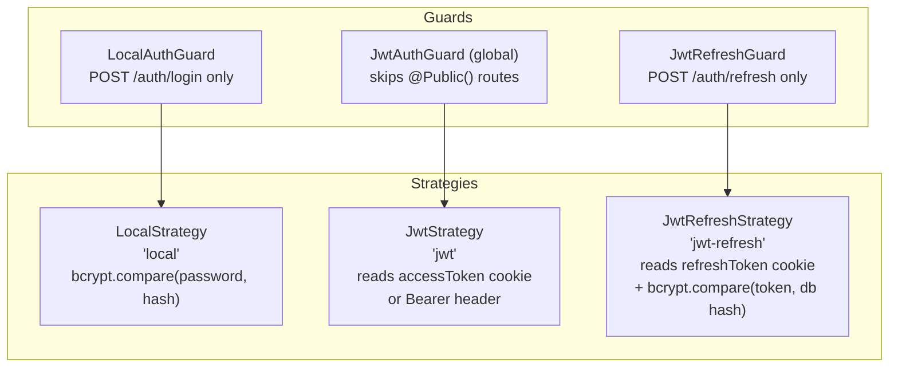
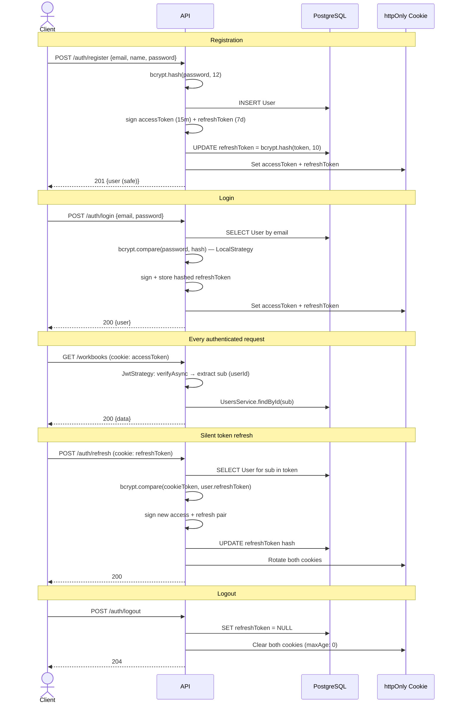

# Authentication

## Strategy Overview

OnSheet uses **JWT-based authentication** with two tokens stored in **httpOnly cookies**. Passport.js handles strategy execution inside NestJS guards.



---

## Token Lifecycle



---

## Cookie Configuration

| Cookie | Value | Max Age | Path | httpOnly |
|---|---|---|---|---|
| `accessToken` | Signed JWT | 15 minutes | `/` | ✓ |
| `refreshToken` | Signed JWT | 7 days | `/api/v1/auth` | ✓ |

**Production** (`NODE_ENV=production`): `sameSite: "none"`, `secure: true` — required for cross-origin Next.js ↔ NestJS.  
**Development**: `sameSite: "lax"`.

Scoping the refresh cookie to `path: /api/v1/auth` prevents it from being sent on every request.

---

## JWT Configuration

| Token | Secret env var | Expiry |
|---|---|---|
| Access | `JWT_ACCESS_SECRET` | 15 minutes |
| Refresh | `JWT_REFRESH_SECRET` | 7 days |

`JwtModule` is registered with `useFactory` (no hardcoded defaults). Secrets are pulled from `ConfigService` at call time inside `AuthService.generateTokens`.

---

## Guard Behaviour

### `JwtAuthGuard` (global)

Applied to every route via `APP_GUARD`. Reads `accessToken` from the cookie, or falls back to `Authorization: Bearer <token>`. Skips entirely if the route handler (or its controller) is decorated with `@Public()`.

### `JwtRefreshStrategy`

Extends the standard JWT strategy but:
1. Reads from the `refreshToken` cookie (or `req.body.refreshToken` as fallback)
2. After decoding, does a `bcrypt.compare(rawToken, user.refreshToken)` to validate the token hasn't been rotated away — prevents refresh token reuse after logout.

---

## `@Public()` Decorator

Sets metadata `isPublic = true`. `JwtAuthGuard.canActivate` checks this reflector flag and short-circuits to `true` if found.

Routes marked public: `/health`, `/auth/register`, `/auth/login`, `/auth/refresh`, `/workbooks/public/:shareToken`, `/public/sheets/:token/:sheetId/cells`.

---

## `@CurrentUser(field?)` Decorator

Param decorator that extracts `req.user` (or a specific field from it) from the Passport-augmented request. `req.user` is typed as `Omit<User, 'passwordHash' | 'refreshToken'>` — sensitive fields are never on the request object.

---

## Auth Endpoints

| Method | Path | Guard | Rate Limit |
|---|---|---|---|
| POST | `/api/v1/auth/register` | `@Public()` | 10 / 60 s |
| POST | `/api/v1/auth/login` | `@Public()` + `LocalAuthGuard` | 10 / 60 s |
| POST | `/api/v1/auth/refresh` | `@Public()` + `JwtRefreshGuard` | 10 / 60 s |
| POST | `/api/v1/auth/logout` | JWT (global) | 10 / 60 s |
| GET | `/api/v1/auth/me` | JWT (global) | 10 / 60 s |

### Register — `POST /api/v1/auth/register`

```jsonc
// Request
{ "email": "alice@example.com", "name": "Alice", "password": "secret123" }

// 201 Response
{ "success": true, "data": { "id": "...", "email": "...", "displayName": "Alice", "avatarUrl": null, "createdAt": "..." } }
```

### Login — `POST /api/v1/auth/login`

```jsonc
// Request
{ "email": "alice@example.com", "password": "secret123" }

// 200 Response — sets accessToken + refreshToken cookies
{ "success": true, "data": { /* safe user */ } }
```
