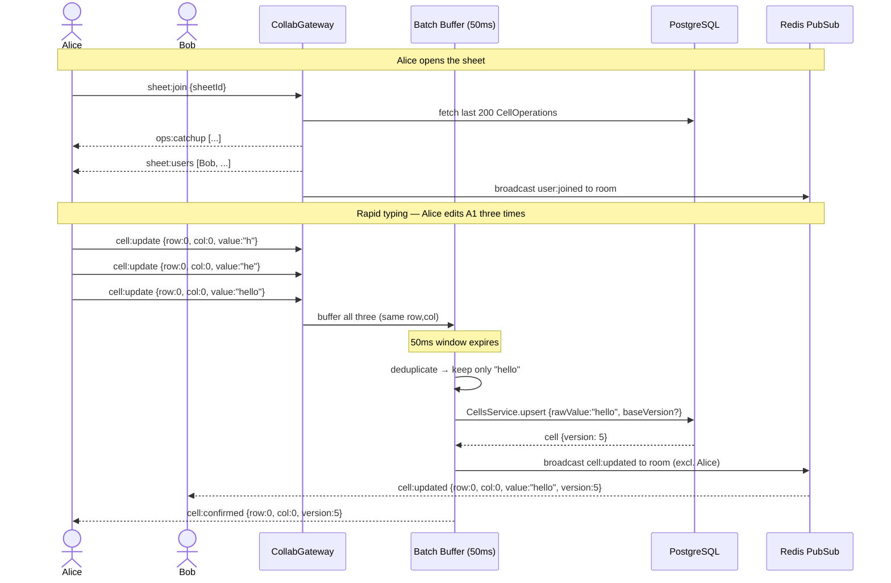
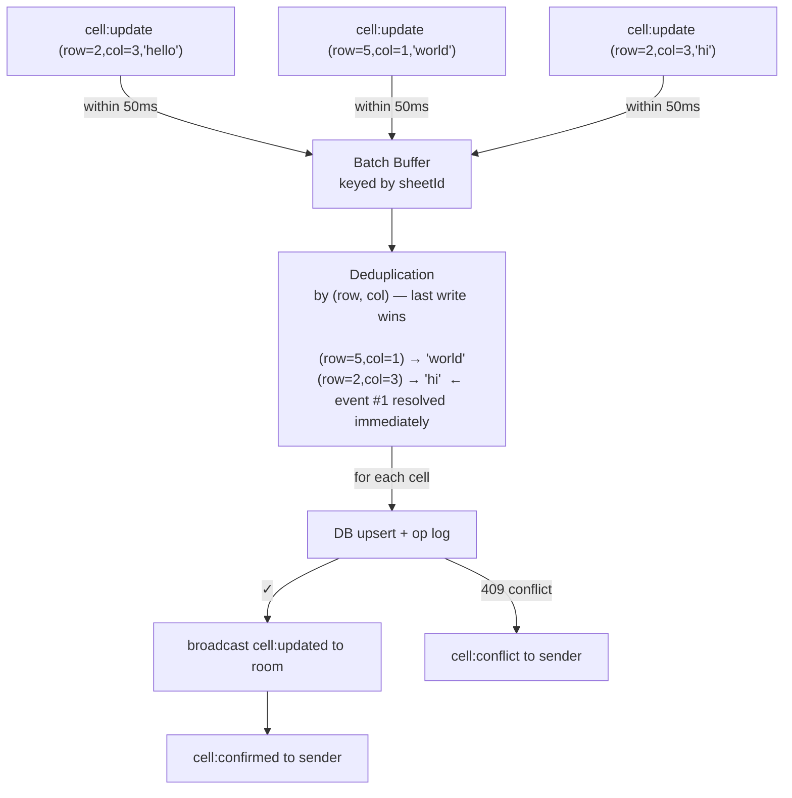
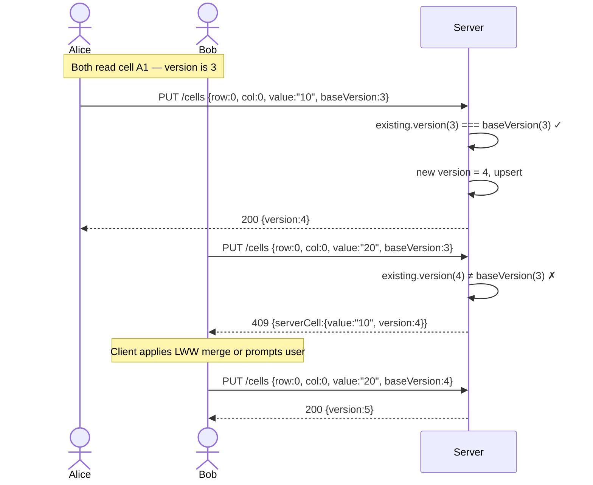
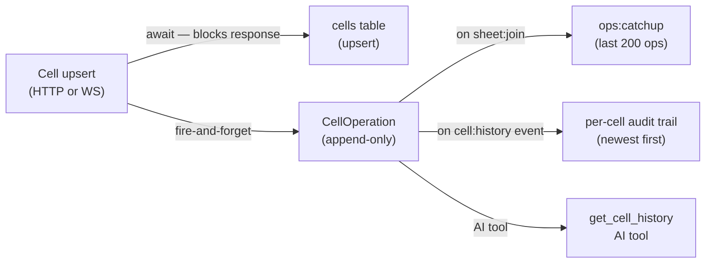

# Collaboration & Real-Time Sync

OnSheet uses a **Last-Writer-Wins (LWW)** collaborative model with **Optimistic Concurrency Control (OCC)** at the cell level. There is no CRDT data type — instead, each cell carries a monotonically increasing `version` integer, and the system detects mid-air collisions server-side.

---

## End-to-End Edit Flow



---

## Write Batching

The gateway accumulates `cell:update` events in a per-sheet buffer. A **50 ms timer** fires after the first write in a cycle and flushes the buffer.



**Why batch?** Users type character-by-character. Without batching, a single word would create 5+ DB round-trips and 5+ broadcasts. With batching, only the final value is persisted.

---

## Optimistic Concurrency Control (OCC)

Every `Cell` row has a `version` integer. Clients may optionally send `baseVersion` when writing. The server compares it against the current DB version.



The same logic runs inside the WebSocket write path. On conflict, the server emits `cell:conflict { row, col, serverCell }` so the client can reconcile.

If `baseVersion` is **omitted**, the write is unconditional (no conflict check). Useful for bulk import and AI writes.

---

## Operation Log

Every successful cell write appends a row to `CellOperation`. This is **fire-and-forget** — it never blocks the write path (no `await`).



The `CellOperation` table has two indexes:
- `(sheetId, createdAt DESC)` — for catchup queries
- `(sheetId, row, col)` — for per-cell history queries

---

## Late-Joiner Catchup

When a client joins a sheet room, the gateway immediately sends the last **200** operations:

```ts
socket.emit("ops:catchup", recentOps);
```

> **`sinceVersion` — planned but not implemented:** The `sheet:join` payload accepts a `sinceVersion` field and the websockets doc mentions it, but the gateway currently ignores it — it always calls `opLog.getRecent(sheetId, 200)` unconditionally. Incremental reconnect without a full cell-list refetch is the intended future behaviour.

---

## Cursor Sharing

Cursors are ephemeral. No DB writes. The sequence:

1. Client emits `cursor:move { row, col }`
2. Gateway calls `CollabService.updateCursor(sheetId, socketId, { row, col })`
3. Gateway broadcasts `cursor:moved { socketId, row, col }` to the room, excluding the mover

Cursor state is stored in `CollabService`'s in-memory `Map` and is lost on server restart.

---

## Conflict Resolution Strategy Summary

| Scenario | Handling |
|---|---|
| Multiple rapid writes from same user to same cell | 50 ms batch deduplication — last write survives, earlier ones are silently resolved |
| Two users simultaneously editing same cell (detected) | `cell:conflict` emitted with `serverCell`; client must re-merge before retrying |
| Two users editing same cell (no `baseVersion`) | Last write wins unconditionally — no conflict detection |
| Network disconnect + reconnect | Client rejoins room, receives `ops:catchup`, reconciles local state |
| Server restart | Presence reset; cells persisted in DB; client reconnects and re-fetches |
