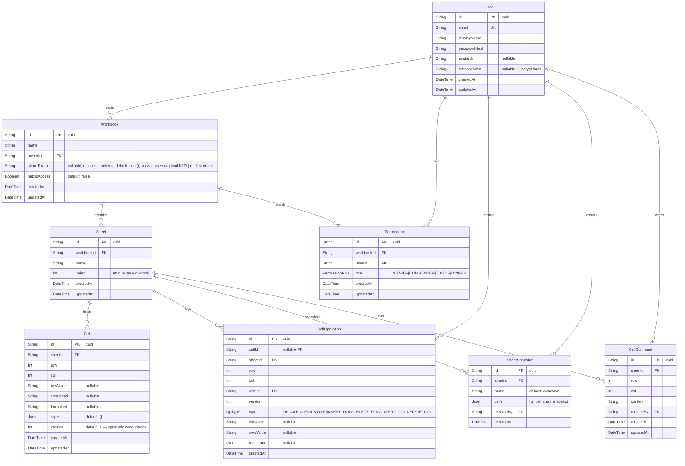

# Database

Provider: **PostgreSQL 16**  
ORM: **Prisma 6** with `@prisma/adapter-pg` driver adapter (preview feature: `driverAdapters`)

---

## Entity Relationship Diagram



---

## Models

### `User`

- `id` — cuid primary key
- `email` — unique index
- `passwordHash` — bcrypt 12 rounds; never returned to clients
- `refreshToken` — bcrypt hash of the current refresh token; nulled on logout

### `Workbook`

- `shareToken` — unique cuid, generated lazily when public access is toggled on
- `publicAccess` — boolean; public workbooks expose read-only cells via share token

### `Sheet`

- `(workbookId, index)` — unique composite constraint; prevents duplicate tab positions

### `Cell`

- `(sheetId, row, col)` — unique composite constraint; single source of truth per grid coordinate
- `version` — monotonically increasing integer used for optimistic concurrency control
- `style` — arbitrary JSON blob (font, fill, borders, alignment, number format…)
- `rawValue` — what the user typed (e.g. `=SUM(A1:A10)` or `hello`)
- `computed` — formula evaluation result (e.g. `42`)
- `formatted` — display-formatted value (e.g. `$42.00`)

### `CellOperation`

Append-only audit log. Written fire-and-forget (never blocks the response path).

- `(sheetId, createdAt DESC)` — index for fast "recent ops" queries (catchup)
- `(sheetId, row, col)` — index for per-cell history queries

### `Permission`

- `(workbookId, userId)` — unique composite constraint; one role per user per workbook
- Role order: `OWNER > EDITOR > COMMENTER > VIEWER`

### `SheetSnapshot`

- `cells` — JSON array of all cell objects at snapshot time; used for atomic restore
- `(sheetId, createdAt DESC)` — index for listing snapshots

### `CellComment`

- `sheetId` — indexed for per-sheet comment listing

---

## Enums

```prisma
enum PermissionRole {
  VIEWER
  COMMENTER
  EDITOR
  OWNER
}

enum OpType {
  UPDATE
  CLEAR
  STYLE
  INSERT_ROW
  DELETE_ROW
  INSERT_COL
  DELETE_COL
}
```

---

## PrismaService

Extends `PrismaClient`. Uses `PrismaPg` driver adapter backed by a `pg.Pool`.

- `onModuleInit` — connects
- `onModuleDestroy` — disconnects + calls `pool.end()`

Exported from `PrismaModule` which is `@Global()`, making `PrismaService` available everywhere without explicit imports.
