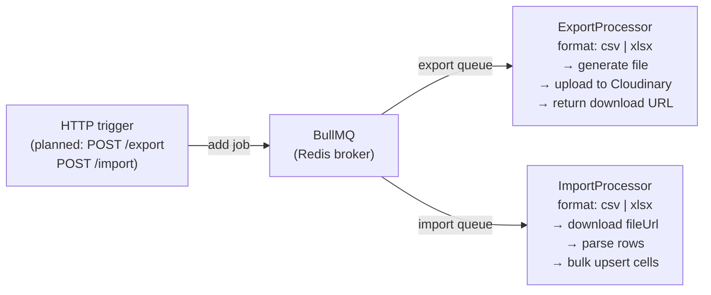

# Background Jobs

OnSheet uses **BullMQ** backed by Redis for async processing of spreadsheet export and import operations.

---

## Queue Architecture



Both queues connect to the same Redis instance used by the WebSocket adapter and AI context store.

---

## Processors

### `ExportProcessor` — queue: `"export"`

**Job data:**
```ts
{ workbookId: string; userId: string; format: "csv" | "xlsx" }
```

**Current status:** Stub implementation. Marks job progress to 100% and returns:
```ts
{ status: "done", url: null }
```

**Planned implementation:**
1. Load all sheets and cells from DB for `workbookId`
2. Generate CSV or XLSX using a library (e.g. `exceljs`, `papaparse`)
3. Upload to Cloudinary, return download URL
4. Notify user via WebSocket or email

---

### `ImportProcessor` — queue: `"import"`

**Job data:**
```ts
{ workbookId: string; sheetId: string; userId: string; fileUrl: string; format: "csv" | "xlsx" }
```

**Current status:** Stub implementation. Marks job progress to 100% and returns:
```ts
{ status: "done", rowsImported: 0 }
```

**Planned implementation:**
1. Download file from `fileUrl`
2. Parse rows using appropriate parser
3. Call `CellsService.bulkUpsert` (raw SQL, batched at 3 000 rows)
4. Return `rowsImported` count

---

## Redis Connection

Both processors use the same Redis config as the rest of the app (parsed from `REDIS_URL` or `REDIS_HOST`/`REDIS_PORT`/`REDIS_PASSWORD`). Supports `rediss://` for TLS.
