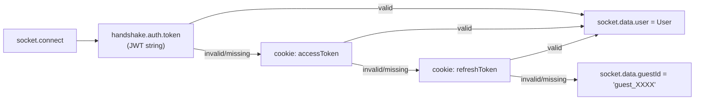

# WebSocket Events

**Namespace:** `/collab`  
**Transport:** WebSocket (Socket.io)  
**Scaled via:** `RedisIoAdapter` — events broadcast across all server instances.

---

## Connection

### Authentication

On `connect`, `CollabGateway` attempts authentication in this order:



Guests can join rooms and move cursors but **cannot** emit `cell:update`.

### Connection example (client-side)

```ts
const socket = io("http://localhost:4000/collab", {
  withCredentials: true,   // send httpOnly cookies automatically
  auth: { token: accessToken }  // optional — cookies are preferred
});
```

---

## Rooms

| Room key | Members |
|---|---|
| `{sheetId}` | All users viewing that sheet (bare ID, no prefix) |
| `workbook:{workbookId}` | All users with any sheet in that workbook open |

Joining the sheet room (`sheetId` as the room name) also joins `workbook:{workbookId}` (if `workbookId` provided in payload).

---

## Client → Server Events

### `sheet:join`

Join a sheet room and receive current state.

```ts
socket.emit("sheet:join", {
  sheetId: "sheet_abc",
  workbookId: "wb_xyz",     // optional — enables workbook-level events
  displayName: "Alice",      // optional — overrides profile name for presence
  sinceVersion?: number      // field accepted but NOT currently used — see note below
});
```

**Server response (to joining client):**
- `sheet:users` — array of currently online users
- `ops:catchup` — last **200** operations for the sheet (always the last 200, regardless of `sinceVersion`)

> **Note:** `sinceVersion` is accepted in the payload for forward-compatibility but the gateway currently ignores it — it always calls `opLog.getRecent(sheetId, 200)` unconditionally. Incremental catchup by version is a planned enhancement.

**Server broadcast (to room, except joiner):**
- `user:joined` — updated user list

---

### `cursor:move`

Broadcast cursor position to all other users in the room.

```ts
socket.emit("cursor:move", { row: 3, col: 5 });
```

**Server broadcast:** `cursor:moved` to room, excluding the mover.

---

### `cell:update`

Write a cell value. Subject to 50 ms write batching and last-writer-wins deduplication — see [Collaboration](./collaboration.md).

```ts
socket.emit("cell:update", {
  sheetId: "sheet_abc",
  cell: {
    row: 2,
    col: 3,
    rawValue: "=SUM(A1:A10)",
    computed: "55",
    formatted: "55",
    style: {},
    baseVersion: 4   // optional — for conflict detection
  }
});
```

**Server response (to sender):**
- `cell:confirmed { row, col, version }` on success
- `cell:conflict { row, col, serverCell }` on version mismatch

**Server broadcast (to room, except sender):**
- `cell:updated { userId, cell: { row, col, rawValue, computed, style, version } }`

---

### `cell:history`

Request the operation log for a specific cell.

```ts
socket.emit("cell:history", { sheetId: "sheet_abc", row: 2, col: 3, limit: 20 });
```

**Server response (to requesting client only):**
- `cell:history` — array of `CellOperation` records, newest first

---

## Server → Client Events

| Event | Recipient | Payload | Description |
|---|---|---|---|
| `sheet:users` | Joining client | `ActiveUser[]` | Snapshot of who is currently online |
| `user:joined` | Room (excl. joiner) | `ActiveUser[]` | Updated user list after someone joins |
| `user:left` | Room | `{ socketId: string }` | Someone disconnected |
| `ops:catchup` | Joining client | `CellOperation[]` | Recent ops for late-joiner sync |
| `cursor:moved` | Room (excl. mover) | `{ socketId, row, col }` | Collaborator cursor position |
| `cell:updated` | Room (excl. sender) | `{ userId, cell }` | Cell changed by collaborator |
| `cell:confirmed` | Sender only | `{ row, col, version }` | Server-confirmed write |
| `cell:conflict` | Sender only | `{ row, col, serverCell }` | Version mismatch — re-merge needed |
| `cell:history` | Requesting client | `CellOperation[]` | Per-cell op log |
| `collab:error` | Requesting client | `{ message: string }` | Error (e.g. guest write attempt) |
| `sheet:created` | `workbook:{id}` room | `{ sheet: { id, name, index, workbookId } }` | New sheet added via HTTP |
| `sheet:deleted` | `workbook:{id}` room | `{ sheetId: string }` | Sheet removed via HTTP |

---

## `ActiveUser` Shape

```ts
interface ActiveUser {
  userId: string;
  displayName: string;
  socketId: string;
  color: string;    // one of 8 hex values, cycled by join order
  cursor?: { row: number; col: number };
}
```

User colors (cycle in order): `#ef4444` · `#f97316` · `#eab308` · `#22c55e` · `#06b6d4` · `#3b82f6` · `#8b5cf6` · `#ec4899`

---

## Disconnect

On disconnect:

1. `CollabService.leave(sheetId, socketId)` — removes user from in-memory room map
2. `user:left { socketId }` broadcast to room
3. Socket leaves `workbook:{workbookId}` room

Presence state is **in-memory only** — it does not survive server restarts. This is intentional: presence is ephemeral, no DB writes for cursor/online events.
